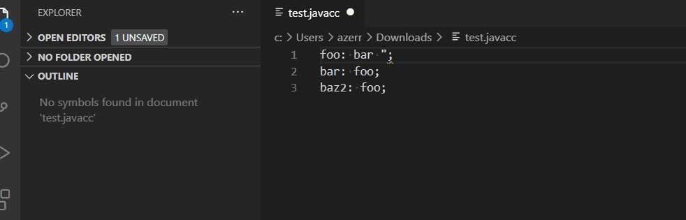

# javacc21-ls

This project provides a Language Server for JavaCC21 and a client for Eclipse IDE and vscode.

The Language Server for JavaCC21 supports:

 * symbols for JavaCC grammar (outline)
 * validation for JavaCC grammar
 * definition for identifier
 * highlight for identifiers

 See the following demo:
 
 